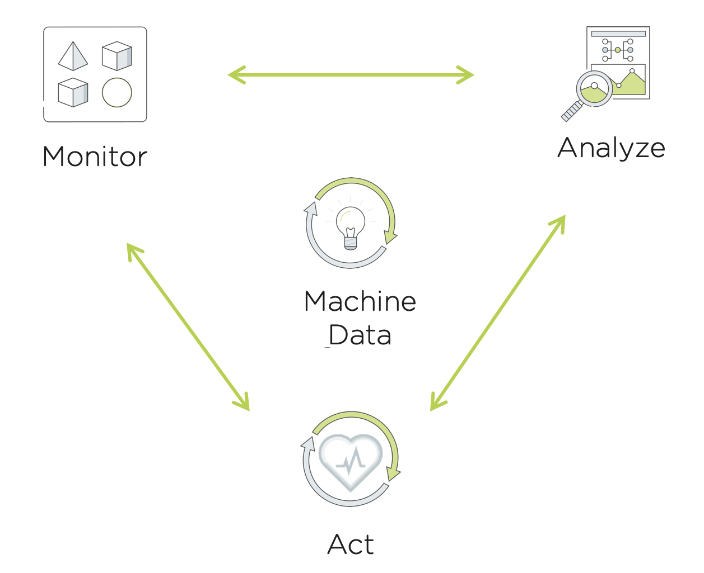

--------------------------
Prism Pro 资源倒计时
--------------------------

Prism Pro为我们的客户的日常IT操作带来了智能自动化。典型的操作工作流是一个监视、分析和采取必要行动的连续循环。 Prism Pro反映了传统IT Admin的工作流程，以提高运营效率。 借助Prism Pro，IT管理员可以使用机器学习引擎X-FIT和X-Play自动化引擎的强大功能，将机器数据中的洞察力连接起来，来自动化该典型流程。

在本实验室中，您将了解Prism Pro如何帮助IT管理员在集群runway不足时进行监视、分析和自动操作的。

实验设置
+++++++++

#. 打开您的 **Prism Central** 并导航至 **VMs** 页面。 记下 **PrismOpsLabUtilityServer** 的IP地址。 在整个实验过程中，您将需要访问此IP地址。

   .. figure:: images/init1.png

#. 在浏览器中打开一个新标签，然后浏览至 http://`<PrismOpsLabUtilityServer>`/alerts [example http://10.38.17.12/alerts]. 如果您是第一个使用该虚拟机的人，则可能需要登录该虚拟机。 只需填写 **Prism CentralIP** ，**Username** 和 **Password**，然后单击 **Login**。

   .. figure:: images/init2.png

#. 一旦你登陆到提醒页面，请保持打开选项卡。 它将在本实验的后续部分中使用。

   .. figure:: images/init2b.png

#. 在另一个选项卡中，导航至http：//`<PrismOpsLabUtilityServer>`/，从[示例http://10.38.17.12/]完成实验。 使用此URL上的UI可以完成实验。

   .. figure:: images/init3.png

容量规划资源倒计时监控
++++++++++++++++++++++++++++++++++++++

资源倒计时是对给定群集或节点内剩余容量的度量。 有一个总体集群资源倒计时，以及针对CPU，内存和存储容量的单独资源倒计时。 资源倒计时是使用Prism Pro的机器智能引擎X-FIT计算的。 让我们查看您的实验中集群的资源倒计时。

#. 在 **Prism Central > Operations > Planning > Capacity Runway** 中。

   - 注意资源倒计时摘要显示每个群集剩余的天数。
   - 当前集群在耗尽内存、CPU和存储之前有多长时间?

#. 单击 **Prism-Pro-Cluster** 集群。

   现在您可以查看资源倒计时上的存储、CPU和内存。

   .. figure:: images/ppro_12.png

#. 在选择Memory选项卡时，您会看到一个红色的感叹号，表示这个集群将在什么地方耗尽内存。您可以将图表悬停在此处，以查看这将发生在哪一天。

   .. figure:: images/ppro_13.png

#. 点击左侧的 **‘Optimize Resources’** 按钮。在这里，您可以看到环境中的低效虚拟机，以及如何优化这些资源以尽可能提高效率的建议。

   .. figure:: images/ppro_14.png

#. 关闭优化资源弹出窗口。

容量规划资源倒计时分析
++++++++++++++++++++++++++++++++++++++

Prism Pro的X-FIT引擎还提供了规划未来工作负载的能力，并确定了可以添加的硬件，以满足新的工作负载资源需求。

#. 在本页左侧的 **‘Adjust Resources’** 部分，单击 **‘Get Started’** 按钮。我们现在可以用它来开始规划新的工作负载，查看未来资源倒计时需要如何扩展。

#. 点击“Workloads”项下方左侧的“add/adjust”按钮。

   .. figure:: images/ppro_15.png

#. 添加一个VDI工作负载，并选择1000个用户。您还可以设置将此工作负载添加到系统的日期。完成后保存此工作负载。

   .. figure:: images/ppro_16.png

   .. figure:: images/ppro_17.png

#. 添加您选择的另一个工作负载。

#. 现在，点击页面右侧的 **‘Recommend’** 按钮。

   .. figure:: images/ppro_18.png

#. 一旦“Recommend”可用，便可以在列表视图和图表视图之间切换，以更好地了解您的方案。

   .. figure:: images/ppro_19.png

#. 点击右上角的 **Generate PDF** 按钮。这将为您创建的scenario/workloads打开一个带有PDF报告的新选项卡。

   .. figure:: images/ppro_19b.png

#. 查看你的报告。

   .. figure:: images/ppro_20.png

使用X-Play自动生成容量预测报告
++++++++++++++++++++++++++++++++++++++++++++++++++++++++

现在让我们看看如何在资源不足的时候自动生成报告。我们将使用Prism Pro的简单自动化引擎X-Play。

#. 使用搜索栏导航到 **Operations** > **Playbook** 页面。

   .. figure:: images/cap1.png

#. 点击表格视图顶部的 **Create Playbook** 。

   .. figure:: images/cap2.png

#. 选择 **Alerts Matching Criteria** 作为触发器。 使用此触发器，我们可以为符合指定条件的一个或多个警报策略触发此Playbook。

   .. figure:: images/cap3.png

#. 选择Specific Alert Policies单选按钮，然后在搜索框中搜索 'runway' 。 从下拉菜单中选择 **Cluster running out of storage Capacity (low runway)** ， **Cluster running out of Memory Capacity (low runway)** ,和 **Cluster running out of CPU Capacity (low runway)** ， 由于这是3个警报，因此我们希望针对存储，内存或CPU运行资源不足的情况下生成报告。

   .. figure:: images/cap4.png

#. 首先，我们要为此警报生成一个预测报告。 点击左侧的 **Add Action**，然后选择 **Generate Forecast Report** 操作。

   .. figure:: images/cap5.png

#. 在这种情况下，Alerts Matching Central:Source Entity将是警报生成的群集。 您也可以根据需要更改Runway Period。

   .. figure:: images/cap6.png

#. 接下来，我们想通知某人该工单是由X-Play创建的。 单击 **Add Action** ，然后选择 **Email** 操作。

   .. figure:: images/cap7.png

#. 填写电子邮件操作中的字段。下面是一些例子：

   - **Recipient:** - Fill in your email address.
   - **Subject :** - ``Playbook {{playbook.playbook_name}} was executed.``
   - **Message:** - `As a result of the alert, {{trigger[0].alert_entity_info.name}}, the playbook, {{playbook.playbook_name}}, was executed. The generated report is attached to this email.``

   .. note::

      欢迎您撰写您自己的主题信息。 以上仅是示例。 您可以使用“parameters”来丰富消息。

   .. figure:: images/cap8.png

#. 单击“Save & Close”按钮，并将其保存为名称 “*姓名缩写* - Automatically Generate Forecast Report”。 **请确保启用“Enabled”状态。**

   .. figure:: images/cap9.png

#. 现在让我们触发工作流程。 切换到您使用 **/alerts** URL  URL [示例 10.38.17.12/alerts]在设置中打开的标签。 选择 **Memory Runway is Short** ，然后单击 **Simulate Alert**。 这将模拟 **Prism-Pro-Cluster** 的内存受限警报。

   .. figure:: images/cap10.png

#. 使用 **Prism Central** 控制台切换回上一个选项卡。 在表格视图中，单击以打开 “*姓名缩写* - Automatically Generate Forecast Report” Playbook的详细信息。

   .. figure:: images/cap11.png

#. 切换到 **Plays** 选项卡，然后单击表中第一个Play的标题进行仔细查看。

   .. figure:: images/cap12.png

#. 可以扩展此视图中的部分以显示每个项目的更多详细信息。 如果有任何错误，这些错误也会出现在这个视图中。

   .. figure:: images/cap13.png

#. 查看你的邮件。 您还应该获得一封带有报告附件的电子邮件，以供您查看。 注意：在5.11中，电子邮件有时最多可能需要5分钟才能发送。

   .. figure:: images/cap14.png
#. 从 **Prism Central** 中 **Delete** 或 **Disable** 您的Playbook，然后再进行其他实验。 由于有多个用户共享实验室环境，因此只要他们启用了此Playbook，他们生成的警报就可能导致您继续接收电子邮件。

   .. figure:: images/cap15.png

重点回顾
.........

- Prism Ops是我们使IT OPS更加智能和自动化的解决方案。 它涵盖从智能检测到自动修复的IT OPS流程。

- X-FIT 是我们的机器学习引擎，可支持智能IT OPS，包括容量预测。

- X-Play, 是企业的IFTTT，是我们实现日常操作任务自动化的引擎，它使每个管理员都可以轻松实现自动化。
